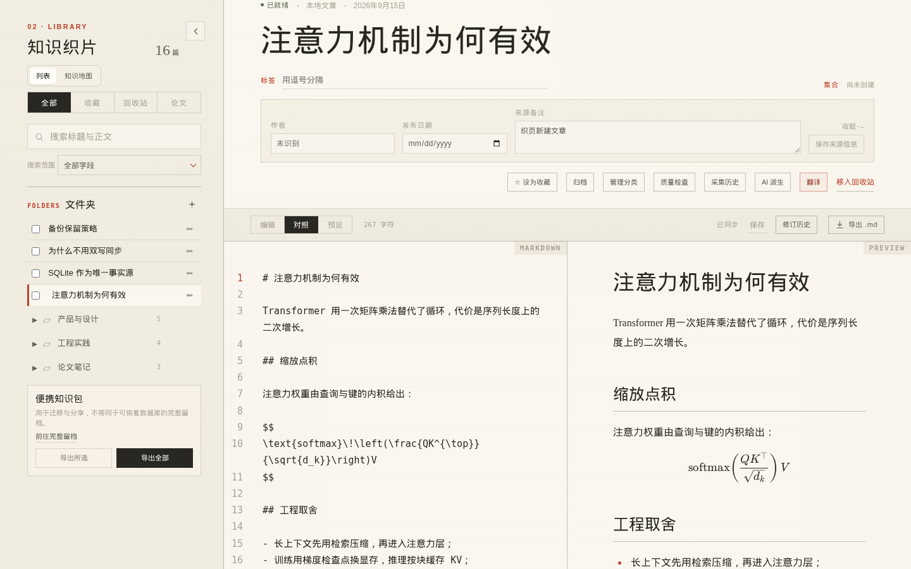
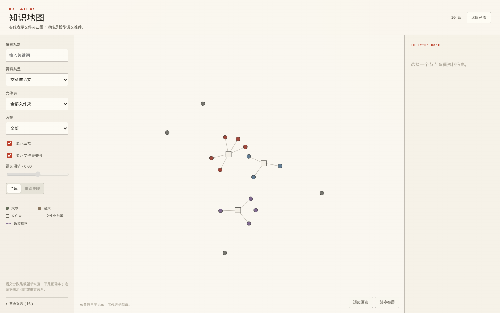

<div align="center">


# 织页 · Zhiye

**把散落的网页，织成可阅读的知识。**

单用户、本机优先的互联网知识库。输入一个公开网页地址，织页会留下正文、来源和可编辑的 Markdown；<br>
搜索、文件夹、知识地图、备份与可选的 AI 派生，全部在你自己这台机器上完成。

[](https://github.com/SaraiNoQ/web-knowledge-set/releases/latest)
[](LICENSE)


[**简体中文**](README.md) · [English](README.en.md)

[下载桌面端](https://github.com/SaraiNoQ/web-knowledge-set/releases/latest) · [使用手册](docs/README.md) · [功能台账](docs/FEATURES.md) · [安全边界](docs/SECURITY.md)

</div>



## 设计取向

网页会消失，收藏夹不保存正文，稍后读服务把你的阅读痕迹变成别人的数据。织页只做一件事：**把值得留存的一页，变成你自己的文件。**

- **本机优先**：SQLite 是唯一事实源，快照与离线图片放在同一个知识库目录里，断网照常阅读。
- **没有账号**：没有登录、没有云同步、没有遥测，也没有崩溃上报。
- **格式可带走**：正文始终是可编辑的 Markdown，随时可以导出成单篇、整库或便携知识包。
- **AI 是可选开关**：默认关闭；打开后每一次发送前都能看到准确范围，桌面端密钥存进 macOS 钥匙串。

## 主要能力

| 能力 | 说明 |
| --- | --- |
| **采集公开网页** | 先直接读取正文；需要脚本时回退到隔离的 Chromium。失败可重试、可暂停队列、可从已有快照重新提取。 |
| **阅读与编辑** | Markdown 编辑与实时预览、`$…$` / `$$…$$` LaTeX 公式、自动保存、修订历史与冲突保护。 |
| **整理与检索** | 一级文件夹、标签、多集合、收藏、归档、回收站，以及标题与正文的中英文搜索。 |
| **知识地图** | 把文章、论文与文件夹归属铺成一张可拖动的图；虚线语义关联需要另配向量服务并明确启用。 |
| **论文逐页对照** | 从 arXiv 或本机 PDF 导入，按页生成原文块与中文译文，逐页对照阅读、编辑与保存译文。 |
| **浏览器剪藏** | Chrome / Firefox 扩展一次性配对后，把当前页面确认成 Markdown 存回本机。 |
| **迁移与留档** | 单篇或整库 Markdown、便携知识 ZIP、Netscape 书签、带校验与恢复的完整留档。 |
| **可选的 AI 派生** | 摘要、提纲、关键词、标签建议、自由对话与保真翻译；结果独立保存，从不覆盖原文。 |



## 快速开始

### macOS 桌面端

从 [Releases](https://github.com/SaraiNoQ/web-knowledge-set/releases/latest) 下载最新的 `Zhiye_*_aarch64.dmg`。

> [!IMPORTANT]
> 桌面端目前使用 **ad-hoc 签名，未经 Apple 公证，也不提供自动更新**。首次打开需要在「系统设置 → 隐私与安全性」中允许运行。

### 本地 Web 模式

需要 Node `24.19.0`（见 `.node-version`）。

```sh
pnpm install --frozen-lockfile
pnpm build
KB_DATA_DIR=/你的/知识库目录 pnpm start
```

服务只监听 `127.0.0.1`，启动后终端会打印一次性地址。数据目录包含数据库、网页快照与离线图片。

### 浏览器扩展

Chrome 解压安装或 Firefox 临时加载 `pnpm build` 生成的 `dist/extensions/` 产物。当前版本 `0.3.6`，**尚未上架扩展商店**。

## 隐私与边界

- 没有账号、云同步、遥测或崩溃数据上传；诊断包只留在本机，导出也不会自动上传。
- 采集会连接你提交的公开地址，并拒绝回环、私网、链路本地及其他非公网地址。
- 登录态网页、Cookie 导入、付费墙、验证码绕过、内网页面和整站爬取都不支持。
- 不支持移动端、Windows / Linux 正式包与多人协作；文件夹只有一层，交叉分类请用标签或集合。
- 语义分数是模型相似度，不是正确率；地图连线只表示文件夹归属或明确标记的语义推荐。

完整说明见 [PRIVACY.md](docs/PRIVACY.md) 与 [SECURITY.md](docs/SECURITY.md)。

## 云端 Web（可选）

同一套接口另有 Cloudflare Worker 实现（Workers Static Assets + D1 + R2 + Queues + Browser Run），部署在 `zhiye.sarainoq.cn`，由 Cloudflare Access 保护、目前仅作者本人使用。

本地库与云端 Web 是**两套独立数据**：文件夹语义一致，但不会自动同步，跨端迁移仍要显式导出与导入。边界见 [CLOUDFLARE.md](docs/CLOUDFLARE.md)。

## 技术栈

Tauri 2 · React 19 · TypeScript · Vite · `node:sqlite`（Node 24 内置）· CodeMirror 6 · KaTeX · pdf.js · react-force-graph · Cloudflare Workers / D1 / R2 / Queues · Playwright

## 文档

| 文档 | 内容 |
| --- | --- |
| [docs/README.md](docs/README.md) | 使用手册：日常流程、快捷键、数据与备份、当前限制 |
| [docs/FEATURES.md](docs/FEATURES.md) | 功能台账与验收边界 |
| [docs/DEVELOPMENT_PLAN.md](docs/DEVELOPMENT_PLAN.md) | 路线、里程碑与发布门槛 |
| [docs/KNOWLEDGE_MAP.md](docs/KNOWLEDGE_MAP.md) · [docs/PAPER_READER.md](docs/PAPER_READER.md) | 知识地图与论文阅读器细则 |
| [docs/SUPPORT.md](docs/SUPPORT.md) | 故障排查、诊断包、安全更新与版本回退 |

## 参与开发

开发、测试、打包与发布都必须在一台受控构建机上完成，本地工作区只用于编辑与同步源码；完整规则见 [AGENTS.md](AGENTS.md)，平台相关产物（macOS DMG）只在受控的 macOS runner 上生成和验证。

## 许可

[MIT](LICENSE) © 2026 SaraiNoQ。打包依赖的许可证与版权声明见 [docs/THIRD_PARTY_NOTICES.md](docs/THIRD_PARTY_NOTICES.md)。
